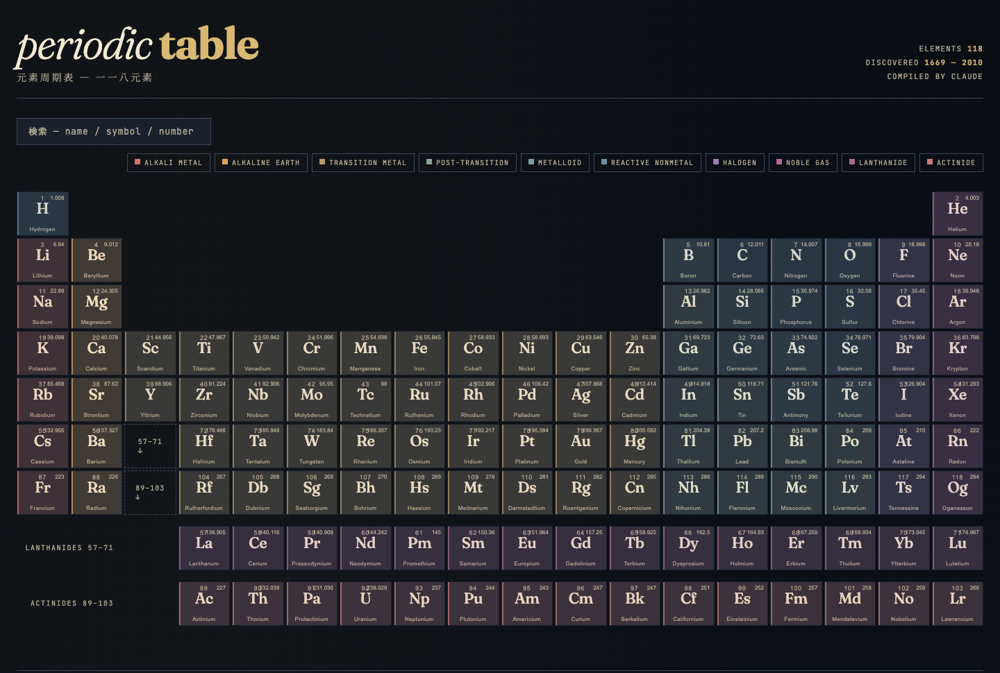
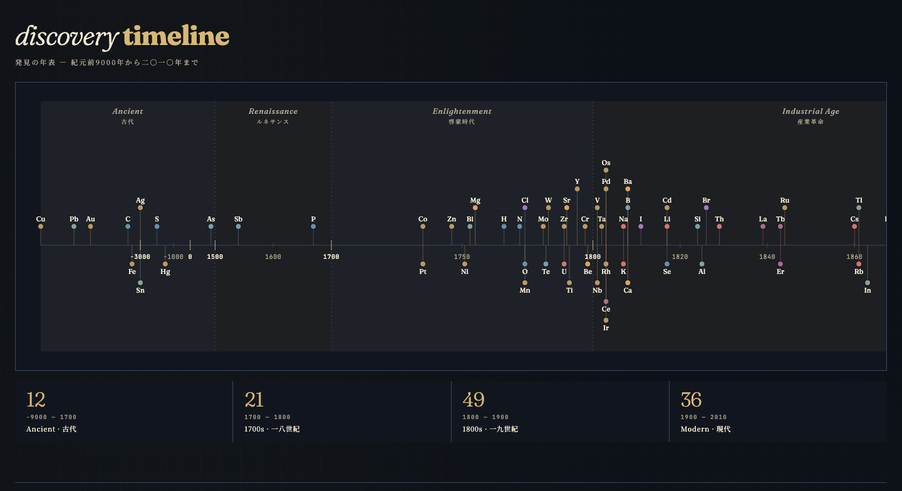
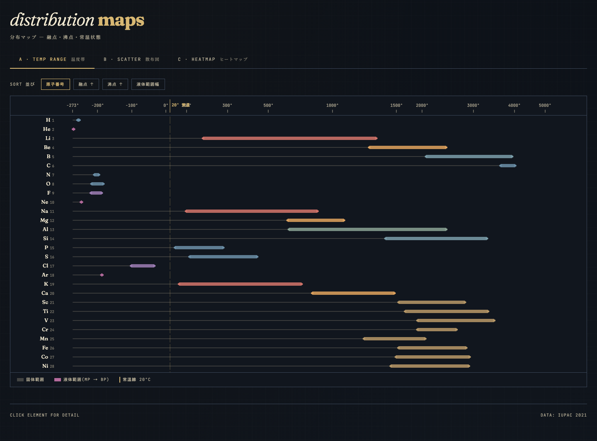

# Periodic Table

> 一一八元素の周期表 — 発見の年表と物性の分布マップを備えた、依存ゼロの静的 SPA。

### [Live Demo — yamadar.github.io/periodic-table](https://yamadar.github.io/periodic-table/)



---

## 特徴

- **118 元素フル収録** — 原子量・電子配置・密度・融点／沸点・常温状態・発見年・発見者まで。元素をクリックすると詳細パネルと **ボーア模型 SVG** が開きます。
- **検索 & カテゴリフィルタ** — 元素名 / 元素記号 / 原子番号で即時絞り込み。アルカリ金属からアクチノイドまで、色分け凡例から 1 クリックで抽出。
- **発見年表 (Discovery Timeline)** — 紀元前 9000 年から 2010 年までを 1 本の SVG タイムラインに収め、Ancient / Renaissance / Enlightenment / Industrial Age / Modern の時代区分で俯瞰できます。
- **分布マップ (Distribution Maps)** — 融点〜沸点の温度範囲バー、散布図、ヒートマップの 3 ビューで物性の分布を可視化。常温線 20°C を重ね、気体／液体／固体が直感的に判別できます。
- **依存ゼロ** — Vite + 素の JavaScript / DOM / SVG のみ。フレームワークなし。

---

## 発見年表

紀元前から現代まで、118 元素の「いつ・誰が」を 1 枚に。時代区分ごとの集計も併記。



## 分布マップ

融点〜沸点の温度範囲を横向きバーで一覧。常温線 (20°C) を縦軸に重ねることで、室温で気体／液体／固体のどれになるかが一目で判ります。原子番号順 / 融点順 / 沸点順 / 液体範囲幅順に並び替え可能。



---

## 技術スタック

| 用途 | ツール |
| --- | --- |
| ビルド & dev サーバー | **Vite 6** |
| テスト | **Vitest 3** (28 件 — データ整合性 / ヘルパー関数) |
| UI | **vanilla JavaScript** + DOM / SVG 直接操作 |
| デプロイ | **GitHub Pages** (push to `main` で自動デプロイ) |

純粋データ層（118 元素配列）／純粋関数層（派生計算）／描画モジュール層（DOM・SVG）／薄いエントリ (`main.js`) の 4 層構成。詳細は [`docs/ARCHITECTURE.md`](./docs/ARCHITECTURE.md) を参照。

---

## ローカル開発

```bash
npm install
npm run dev       # http://localhost:5183/ が自動で開く
npm test          # Vitest 実行
npm run build     # dist/ へ静的ファイル出力
npm run format    # Prettier
```

---

## ライセンス

[MIT](./LICENSE)
